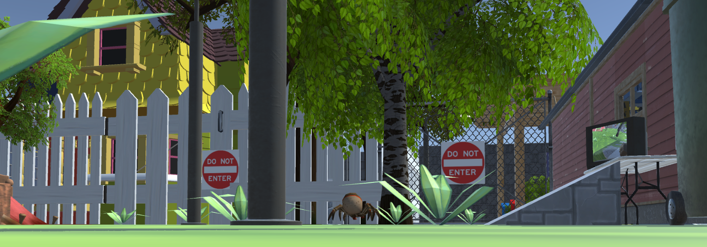

# Web of Unity

This repository contains the sourcecode for our CIS 410 Game Programming Project, Web of Unity. It is playable at https://mexhal.itch.io/web-of-unity. Our C# scripts can be found in WEBOFUNITY -> Assets -> Scripts.

Michael Gao was the project lead and was responsible for leading a team of 2 students by hosting scrum meetings, keep track and distributing tasks, and managing Git submissions and deadlines. He also created the environmental design, level progression, core mechanics, and UI. He also found many assets for the game.

Simon Ward was the asset manager and found many assets for the game, as well being responsible for the sound design and certain gameplay features (pull in towards web, green crosshair, etc).

David Han was the gameplay manager and was responsible for implementing the enemies, as well as enemy/player damage and enemy destruction/hitbox. 

